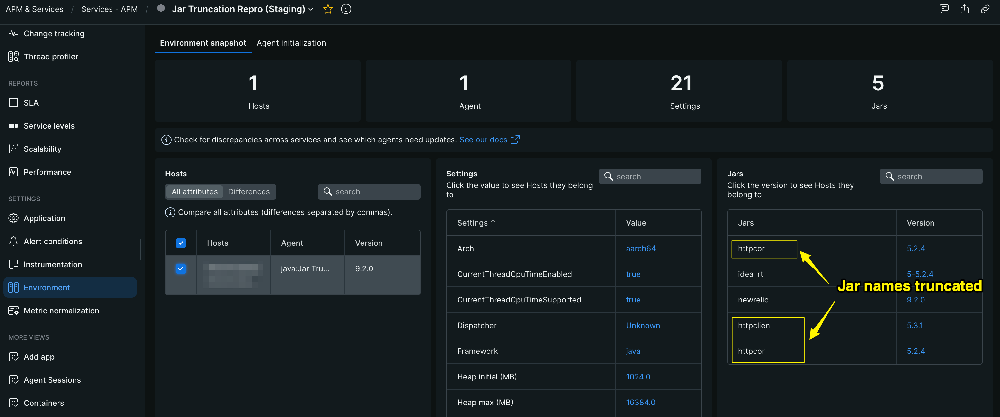
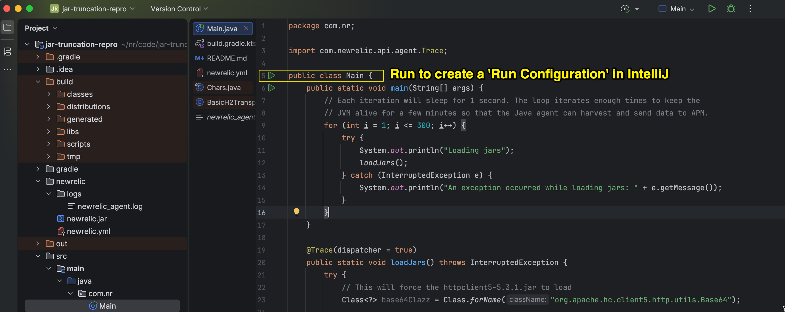
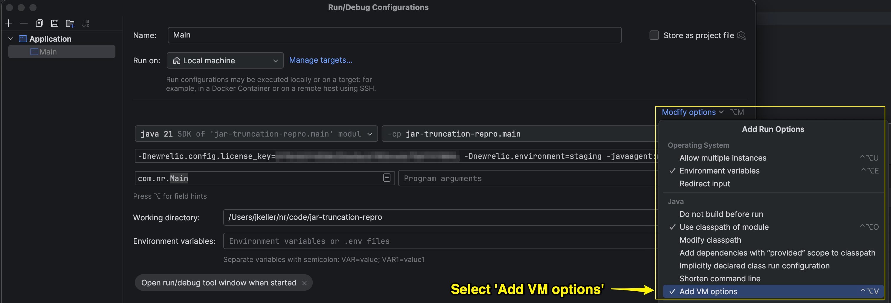
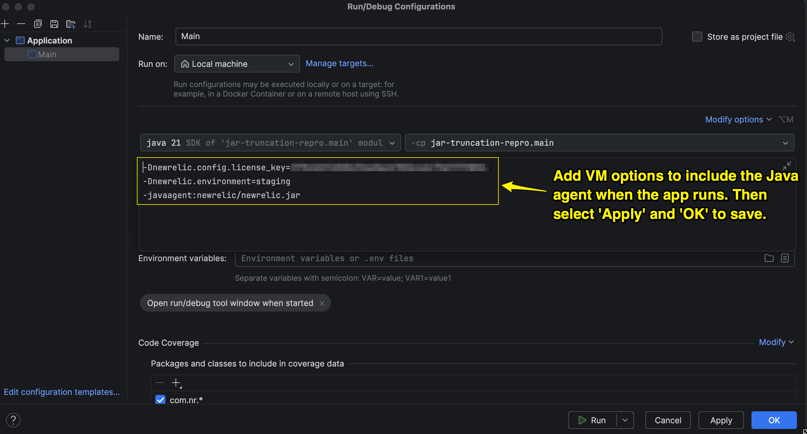

# jar-truncation-repro

Minimal reproduction project for JAR truncation issues with the New Relic Java agent.

This app repros an issue where the agent reports the `httpcore5-5.2.4.jar`, `httpclient5-5.3.1.jar`, and `httpcore5-h2-5.2.4.jar` jar files but the jar names that get displayed in the APM Environment tab are incorrectly truncated by the backend:



## Prerequisites

- JDK 17+

## Build

```bash
./gradlew jar
```

This produces a fat JAR (all dependencies bundled) at:

```
build/libs/jar-truncation-repro-1.0-SNAPSHOT.jar
```

## Run

It is recommended to run this app from the IntelliJ IDE, as creating a fat jar and running that from the commandline may prevent the Java agent from detecting the embedded dependency jars. 

To run with the New Relic agent attached, configure the following within the IntelliJ IDE.

Run the 'Main' class in IntelliJ IDE, this will create a run configuration:



Open the new run configuration in the top right corner of the IDE and select the 'Add VM options' so we can configure the JVM to load the Java agent: 



Add the following VM options so that the Java agent will be loaded when executing the run configuration for the app. Make sure to add a valid APM staging `license_key`. If you prefer to report to an APM production account then change the environment thusly `-Dnewrelic.environment=production` and set a valid APM production `license_key`.

```dotenv
-Dnewrelic.config.license_key=123 
-Dnewrelic.environment=staging 
-javaagent:newrelic/newrelic.jar
```



Once the run configuration is set up as detailed above, you can then execute it and the app will run with the Java agent attached: 


## Agent Logs

Java agent logs can be found in the newrelic/logs directory. After a few minutes, when the agent has harvested and sent data, you can search the logs for the list of jars sent to the `update_loaded_modules` collector endpoint.

```json
2026-05-08T15:36:05,265-0700 [2291 70] com.newrelic INFO: Sent JSON(update_loaded_modules) to: https://staging-collector.newrelic.com:443/agent_listener/invoke_raw_method?method=update_loaded_modules&license_key=obfuscated&marshal_format=json&protocol_version=17&run_id=BUFHfNm4zGphAA893xLjGT5p_mIIAAIBIQArJQEAAAjz8E_fhAIEEuMZPQMABTkuMi4wAApQS1hWSFYyTVYwAB5KYXIgVHJ1bmNhdGlvbiBSZXBybyAoU3RhZ2luZyk, with payload: 
["Jars",[["httpcore5-5.2.4.jar","5.2.4",{"sha1Checksum":"34d8332b975f9e9a8298efe4c883ec43d45b7059","Implementation-Vendor":"The Apache Software Foundation","groupId":"org.apache.httpcomponents.core5","artifactId":"httpcore5","sha512Checksum":"9fb4134d85e665e15410af005b21cd2f9b5e60d75112945d37b879f96f769a70be034557526ea7d05f8b83dda91c56d00f946763c44a183d7aea2857549b4481","Implementation-Vendor-Id":"org.apache","version":"5.2.4"}],["httpclient5-5.3.1.jar","5.3.1",{"sha1Checksum":"56b53c8f4bcdaada801d311cf2ff8a24d6d96883","Implementation-Vendor":"The Apache Software Foundation","groupId":"org.apache.httpcomponents.client5","artifactId":"httpclient5","sha512Checksum":"4c2d75106af8470789f0e08305e64ad86528f2f737da230e561892d33dbca0b6e2dbced2a075f0744cee7801c06ef174481540661b3c9a1bec6d6f93938b05bc","Implementation-Vendor-Id":"org.apache","version":"5.3.1"}],["httpcore5-h2-5.2.4.jar","5.2.4",{"sha1Checksum":"2872764df7b4857549e2880dd32a6f9009166289","Implementation-Vendor":"The Apache Software Foundation","groupId":"org.apache.httpcomponents.core5","artifactId":"httpcore5-h2","sha512Checksum":"72fbee55f173c43d9ffc0cc5a83d59e60be1002c06ab81de39ba700cc30b04e84fdfed73d3a8985d561a1aa8ac3ca905f9259d01b431e1ff14da6fae622f787d","Implementation-Vendor-Id":"org.apache","version":"5.2.4"}]]]
```